# 월간 데이콘 8 : [심리 성향 예측 AI 경진대회](https://dacon.io/competitions/official/235647/overview/) :speech_balloon: 

\+ 멀티캠퍼스 딥러닝 기반 AI 엔지니어링 1차 프로젝트 (데이터 분석 & 시각화)

- __참여__ : [**ineed-coffee**](https://github.com/ineed-coffee) , [__SEJUNHONG__](https://github.com/SEJUNHONG) , [__NOHYC__](https://github.com/NOHYC) ,  [**ikeven94**](https://github.com/ikeven94) 
- __기간__ : 2020.09.28 ~ 2020.11.16
- __주제__ : 마키아벨리즘 설문 답변 내용과 설문자의 개인정보를 통한 국가 투표 여부 예측

---

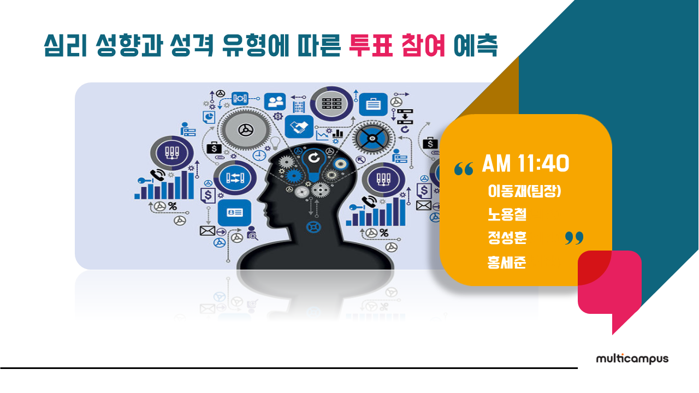

***
# 분석 개요
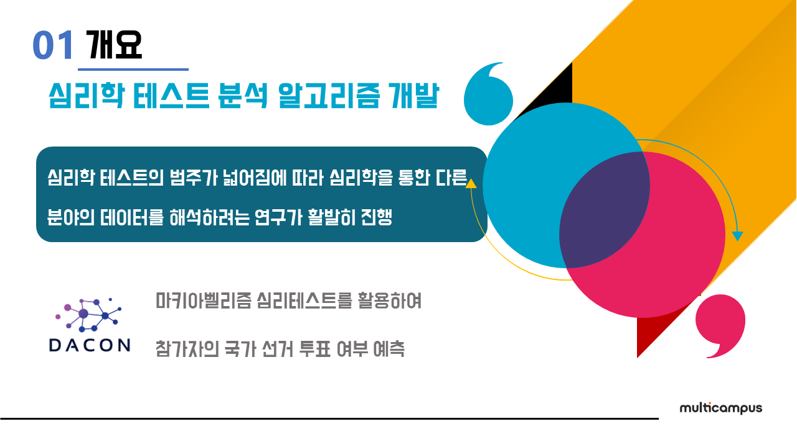
***
# 데이터 변수 설명 (일부)
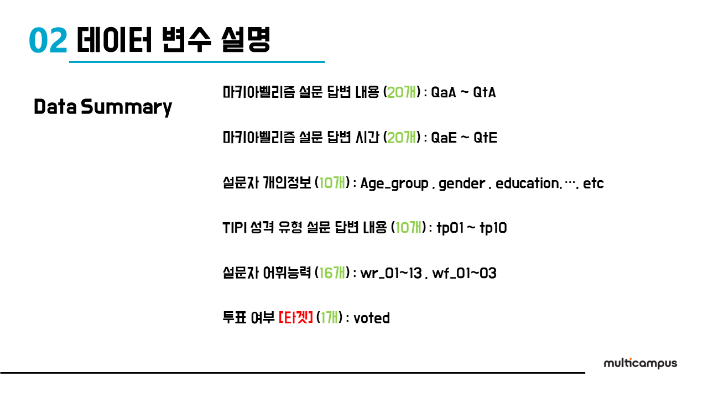
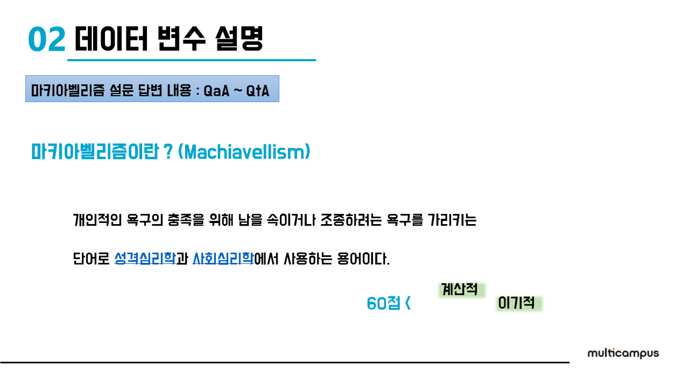
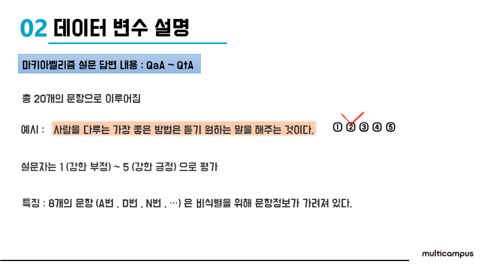

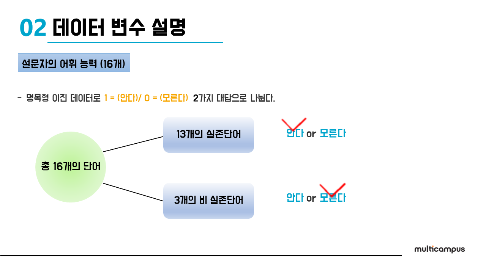
***
# 데이터 전처리 방식 (일부)
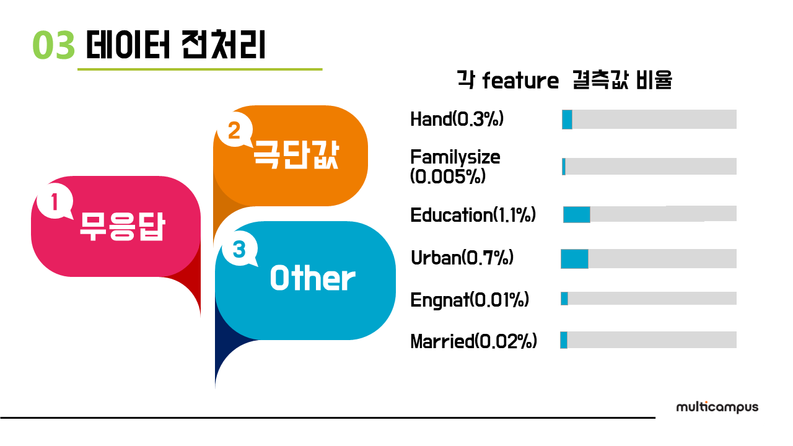
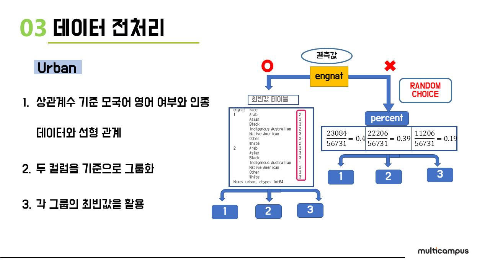
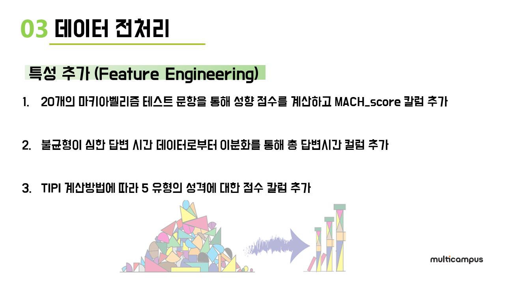
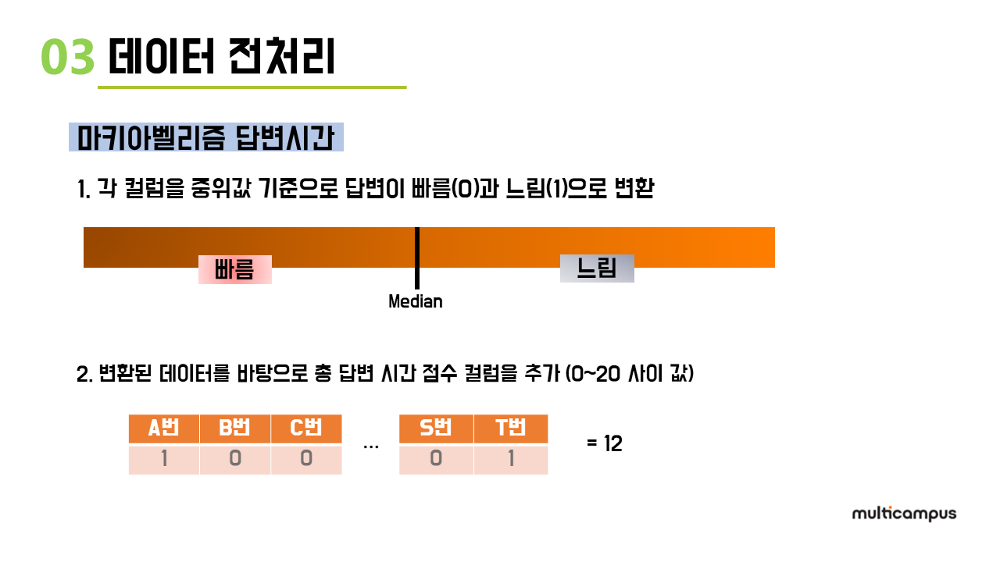
***
# 데이터 분석 주제 (일부)
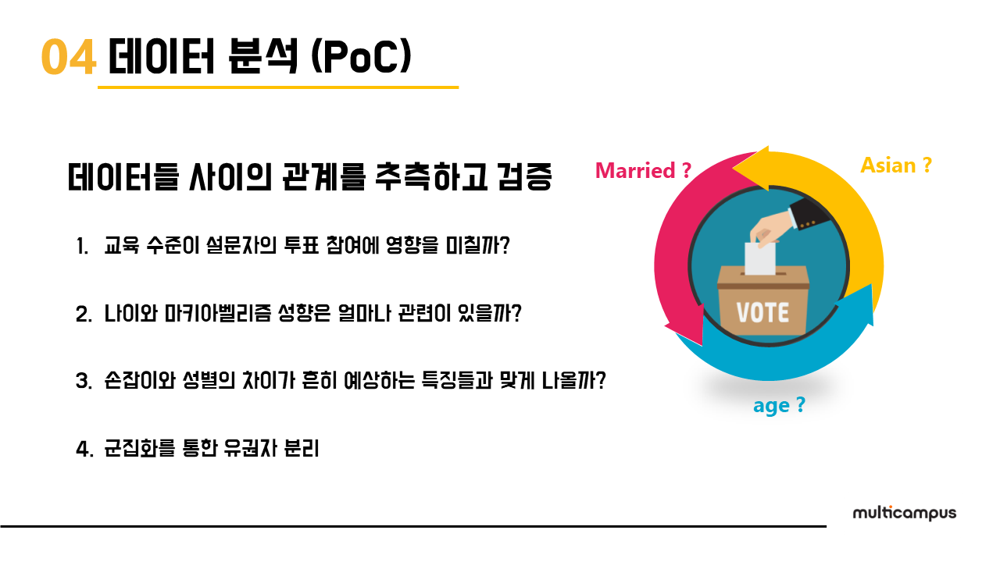
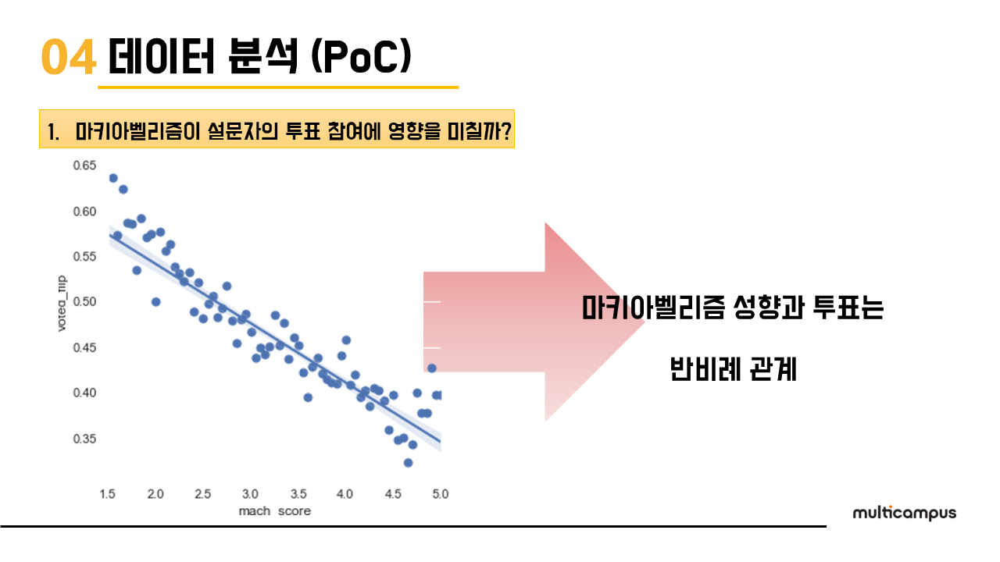
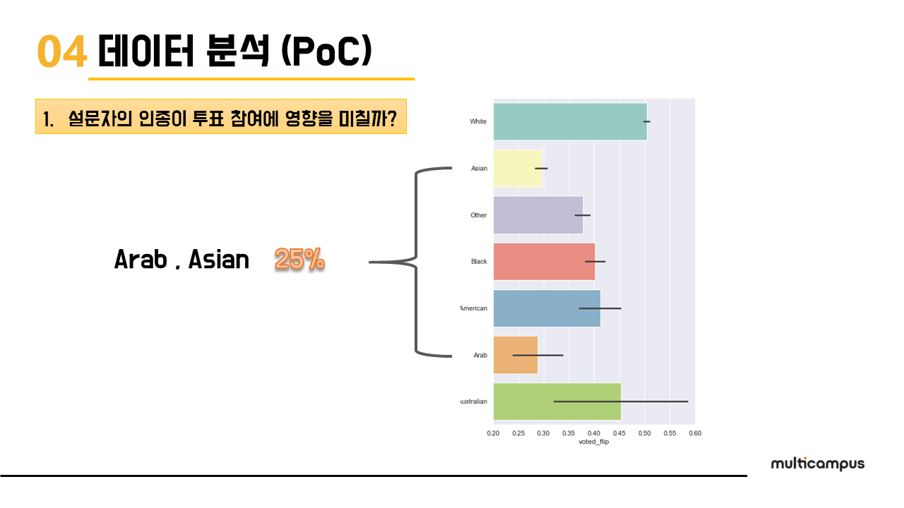
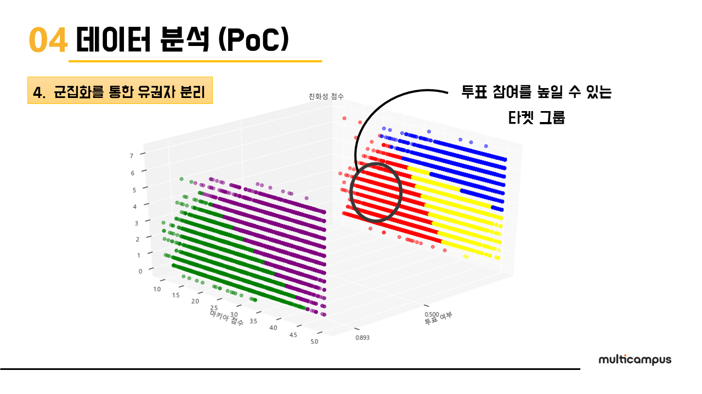
***
# 투표 예측 모델링 (일부)

- Auto ML package `Pycaret` 을 활용하여 여러 ML 모델들 중 best 3 을 ensemble 하여 모델링
- Scorer : `AUC` 
- 최종 모델 AUC : 0.77582 (상위 17%)

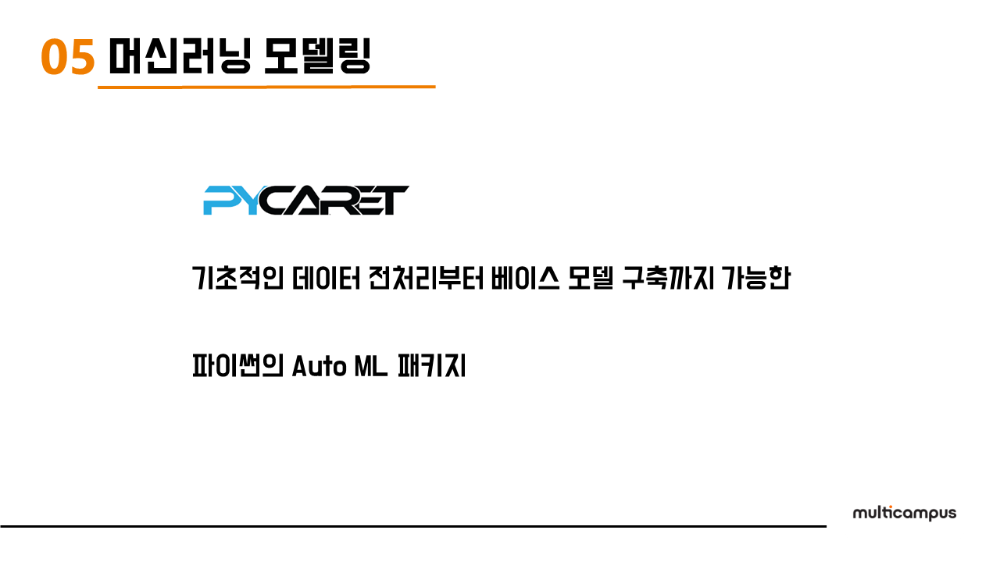
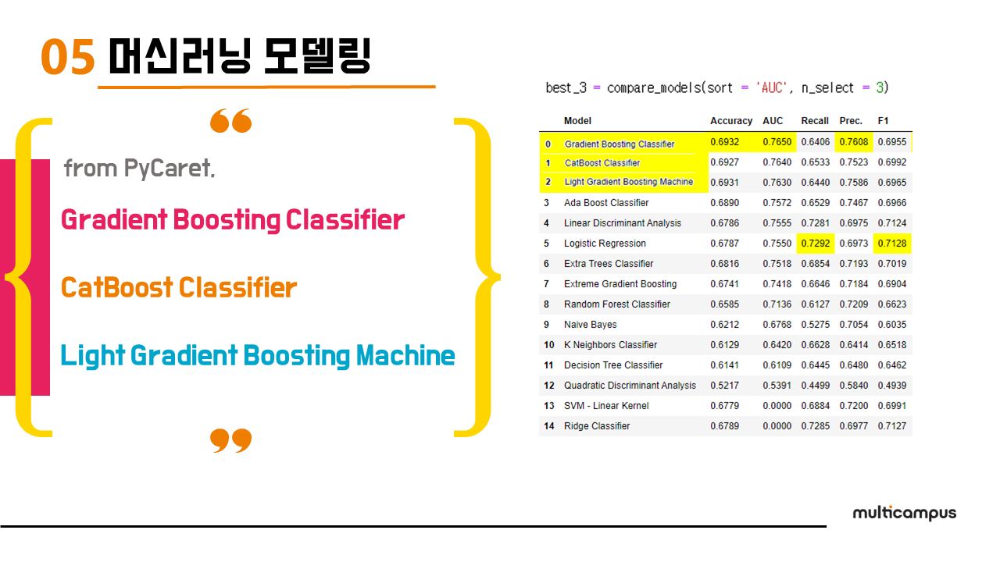
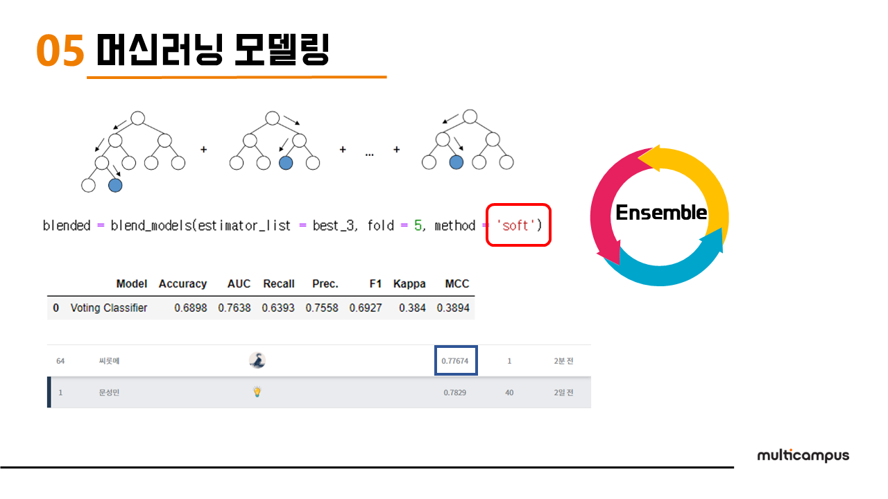

***
